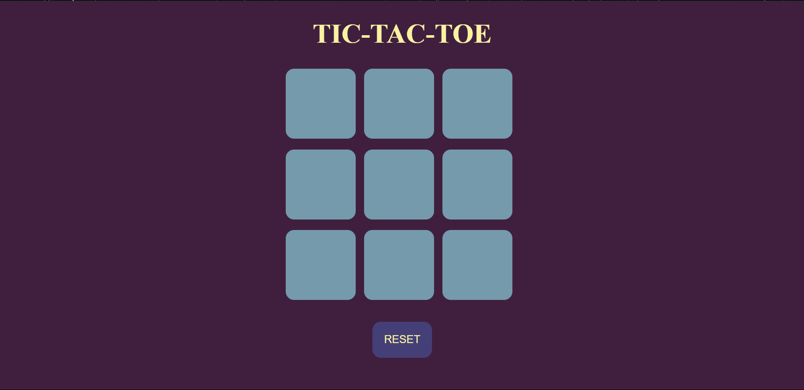
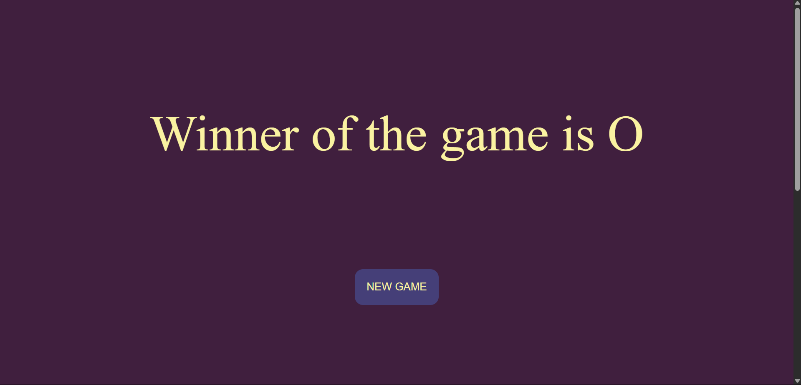

# Tic-Tac-Toe

A simple Tic-Tac-Toe game built with HTML, CSS, and JavaScript.

## Features
- Playable in the browser
- Interactive UI
- Reset and New Game functionality

## How to Play
1. Open `index.html` in your browser.
2. Click on the boxes to make your move.
3. The first player to get three in a row (horizontally, vertically, or diagonally) wins!
4. Use the **RESET** or **NEW GAME** button to start over.

## Files
- `index.html` – Main HTML file
- `style.css` – Styles for the game
- `app.js` – Game logic

## Screenshot

---

Feel free to fork or improve this project!